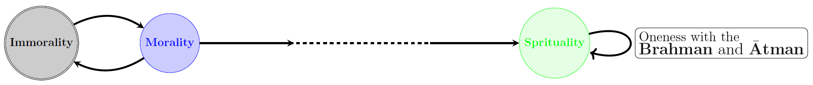
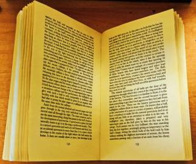

---
# Feel free to add content and custom Front Matter to this file.
# To modify the layout, see https://jekyllrb.com/docs/themes/#overriding-theme-defaults

layout: page
title : "Intro"
#parmalink : https://aqasch.github.io
---

<!--  -->
[{:height="100%" width="100%"}](https://en.wikipedia.org/wiki/Advaita_Vedanta)

I am a Postdoc at [**HelTeq**](https://www.helsinki.fi/en/researchgroups/helteq/people), University of Helsinki in the group of [**Sabrina Maniscalco**](https://researchportal.helsinki.fi/en/persons/sabrina-maniscalco). My research interests lies in the intersection of classical machine learning and quantum computing, where my primary focus is on harnessing near-term quantum hardware with the help of machine learning methods.

##  **List of couple of my most recent publications:** 

###  **Kolmogorov-Arnold Network for Qauntum Architecture Search (KANQAS)** 

KANQAS utilizes Kolmogorov-Arnold Networks (KANs) for quantum architecture search (QAS) problems. QAS is a promising approach for optimizing and automating the design of quantum circuits to achieve quantum advantage.

[{:height="40%" width="40%"}]( https://aqasch.github.io/literature/ )

Our findings points out that the probability of success and the number of optimal quantum circuit configurations generated by KANs to create multi-qubit maximally entangled states are significantly higher compared to multi-layer perceptrons (MLPs). In presence of hardware noise, KANs can achieve better fidelity in approximating maximally entangled states compared to MLPs, whose performance heavily depends on the choice of activation function.

**Here is the the list of publications:**\
Link to [**Google scholar**](https://scholar.google.com/citations?user=0ICcM_YAAAAJ&hl=en).

**Simple explanation to Foundational texts in Indian Philosophy:**\
Just initiated [**The explanation**](https://aqasch.github.io/atmadarshan/).

**Rough compilation of archived expressions:**\
This an abstract collection of small, medium ad large quotes and expressions from Novels, Movies, and a collection of conversation with Aliens and probably etc. Which can be found in <a href="https://aqasch.github.io/arch-exp/"><b>Archived Expressions</b></a>.

**My Interests:**\
[{:height="40%" width="40%"}]( https://aqasch.github.io/literature/ )
