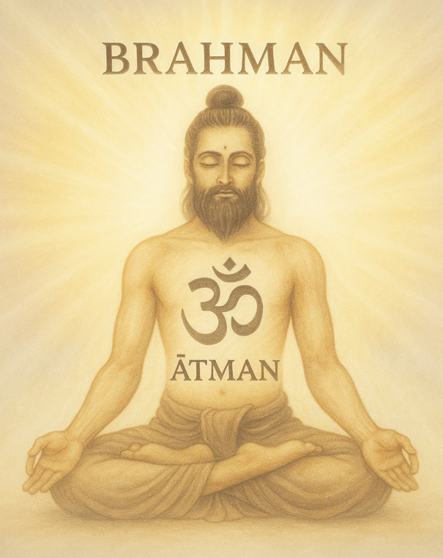
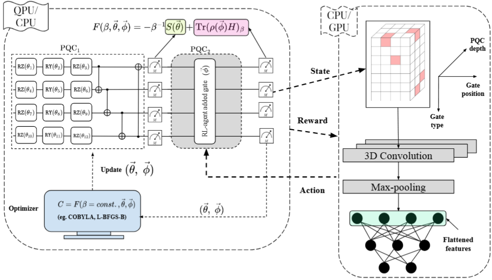

---
# Feel free to add content and custom Front Matter to this file.
# To modify the layout, see https://jekyllrb.com/docs/themes/#overriding-theme-defaults

layout: page
title : "Intro"
#parmalink : https://aqasch.github.io
---

# 👋 Welcome, I am Akash
I am a Postdoc at HelTeq, University of Helsinki, working in the group of Sabrina Maniscalco.
My research focuses on the intersection of classical machine learning and quantum computing, leveraging near-term quantum hardware and beyond with advanced ML methods. I work in **Quantum Architecture Search**. My true self <a href="https://aqasch.github.io/arch-exp/#burden_numbers"><b>Resides Here</b></a>.

  

    
    

      <b>
        <a href="https://scholar.google.com/citations?user=0ICcM_YAAAAJ&hl=en">
          Complete list of publications!
        </a>
      </b>
    

  

  

    
    

      <b>
        <a href="https://aqasch.github.io/atmadarshan/">
          Simple foundational texts in Indian Philosophy.
        </a>
      </b>
    

  

  

    
    

      <b>
        <a href="https://aqasch.github.io/arch-exp/">
          Collection of personal quotes, expressions and conversations.
        </a>
      </b>
    

  

  

    
    

      <b>
        <a href="https://aqasch.github.io/literature/">
          One of my interests: Literature.
        </a>
      </b>
    

  

## **Research highlights**

  

    

      
    

    

      <h3 style="margin-top:0; color:#1a237e;">BenchRL-QAS (Quantum Architecture Search)</h3>
      

        BenchRL-QAS, is a unified benchmarking framework for systematically evaluating reinforcement learning (RL) algorithms in quantum architecture search (QAS) across diverse variational quantum algorithm tasks and system sizes ranging from 2- to 8-qubit. This work represents the most comprehensive RL-QAS benchmarking effort to date. Huge shout-out to my interns <a href="https://www.linkedin.com/in/aditi-das-43b3511aa/">Aditi Das</a>, <a href="https://www.linkedin.com/in/azhar-ikhtiarudin/">Azhar Ikhtiarudin</a> and Param Thakkar! Our primary findings are:
        <ul>
          <li>No single reinforcement learning algorithm is universally optimal for all quantum architecture search tasks.</li>
          <li>RL-based quantum classifiers outperform baseline variational classifiers on quantum machine learning tasks.</li>
          <li>The BenchRL-QAS framework provides a comprehensive benchmark and releases all experimental data publicly to support reproducibility <b>in the following repository:</b></li>
        </ul>
        <b><a href="https://github.com/azhar-ikhtiarudin/bench-rlqas">BenchRL-QAS!</a></b>
      

    

  

  

    

      
    

    

      <h3 style="margin-top:0; color:#1a237e;">Awesome QAS (Quantum Architecture Search)</h3>
      

        A curated list of standout libraries, tutorials, research papers, and essential resources focused on Quantum Architecture Search (QAS). This collection is designed to serve as a structured and thorough reference, empowering researchers and developers to accelerate their work and stay at the forefront of QAS advancements. <b>The repository contains:</b>
        <ul>
          <li>Up-to-date research papers on QAS.</li>
          <li>Open source libraries.</li>
          <li>Videos and tutorials.</li>
        </ul>
        <b><a href="https://github.com/Aqasch/awesome-QAS">Contributions are highly appreciated!</a></b>
      

    

  

  

    

      
    

    

      <h3 style="margin-top:0; color:#1a237e;">Thermal state preparation of Sachdev-Ye-Kitaev model with reinforcement learning on QPU</h3>
      

       The SYK model, known for its strong quantum correlations and chaotic behavior, serves as a key platform for quantum gravity studies. However, variationally preparing thermal states on near-term quantum devices for large systems presents a significant challenge due to the rapid growth in the complexity of parameterized quantum circuits. We address this by combining reinforcement learning with convolutional neural networks, iteratively refining the quantum circuit and its parameters using a composite reward signal from entropy and SYK Hamiltonian expectation values. <b>Key findings:</b>
        <ul>
          <li>Reduces the number of CNOT gates by 100-fold for systems with N ≥ 12 compared to traditional methods!</li>
          <li>For the very first time we show an advantage of QAS with a CNN structure compared to FNN and KANs.</li>
          <li>Reward engineering leading to efficient thermal state preparation in noisy quantum hardware environments!</li>
        </ul>
        <b><a href="https://iopscience.iop.org/article/10.1088/2632-2153/ade361">Published in Machine Learning: Science and Technology!</a></b>
      

    

  

  

    

      
    

    

      <h3 style="margin-top:0; color:#1a237e;">TensorRL-QAS: Reinforcement learning with tensor networks for scalable quantum architecture search</h3>
      

        Introducing TensorRL-QAS, a scalable framework that combines tensor network (TN) methods with RL for designing quantum circuits. By warm-starting the architecture search with a matrix product state approximation of the target solution, TensorRL-QAS effectively narrows the search space to physically meaningful circuits, accelerating convergence to the desired solution. <b> Key findings:</b>
        <ul>
          <li>Scalability in noiseless (noisy) scenario upto 20-qubits (10-qubits)!</li>
          <li>Accelerates training of each RL-episode up to 98%.</li>
          <li>Reduces classicaloptimizer function evaluation by 100-fold.</li>
          <li>Purely CPU based training is now possible up to 10-qubits!!</li>
        </ul>
        <b><a href="https://www.arxiv.org/abs/2505.09371">Follow it on arXiv!</a></b>
      

    

  

