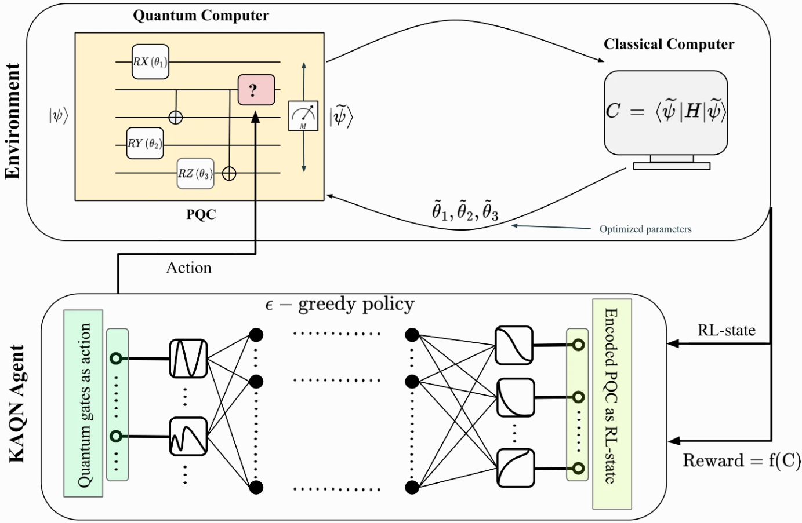

---
# Feel free to add content and custom Front Matter to this file.
# To modify the layout, see https://jekyllrb.com/docs/themes/#overriding-theme-defaults

layout: page
title : "Intro"
#parmalink : https://aqasch.github.io
---

# 👋 Welcome, I am Akash

  

I am a Postdoc at HelTeq, University of Helsinki, working in the group of Sabrina Maniscalco.
My research focuses on the intersection of classical machine learning and quantum computing, leveraging near-term quantum hardware with advanced ML methods. I work in **Quantum Architecture Search**. My true self <a href="https://aqasch.github.io/arch-exp/#burden_numbers"><b>Resides Here</b></a>.

### **Research highlights**

  

    
  

  

    <h3 style="margin-top:0; color:#1a237e;">Awesome QAS (Quantum Architecture Search) </h3>
    

      A curated list of standout libraries, tutorials, research papers, and essential resources focused on Quantum Architecture Search (QAS). This collection is designed to serve as a structured and thorough reference, empowering researchers and developers to accelerate their work and stay at the forefront of QAS advancements. 
      <b>Contains:</b>
      <ul>
        <li>Up-to-date research papers on QAS.</li>
        <li>Open source libraries.
        <li>Videos and tutorials. 
      </ul>
      <b><a href="https://github.com/Aqasch/awesome-QAS">Contributions are highly appreciated!</a></b>
    

  

  

    
  

  

    <h3 style="margin-top:0; color:#1a237e;">KANQAS: Kolmogorov-Arnold Network for Quantum Architecture Search</h3>
    

      KANQAS uses Kolmogorov-Arnold Networks (KANs) for quantum architecture search, optimizing and automating quantum circuit design for quantum hardware. 
      <b>Key findings:</b>
      <ul>
        <li>KANs outperform multi-layer perceptrons (MLPs) in generating maximally entangled states and maintain higher fidelity under hardware noise.</li>
        <li>Enable more compact quantum circuits for molecular ground state discovery.</li>
      </ul>
      <b><a href="https://epjquantumtechnology.springeropen.com/articles/10.1140/epjqt/s40507-024-00289-z">Published in EPJ Quantum Technology!</a></b>
    

  

**Here is the the list of publications:**\
Link to [**Google scholar**](https://scholar.google.com/citations?user=0ICcM_YAAAAJ&hl=en).

**Simple explanation to Foundational texts in Indian Philosophy:**\
Just initiated [**The explanation**](https://aqasch.github.io/atmadarshan/).

**Rough compilation of archived expressions:**\
This an abstract collection of small, medium ad large quotes and expressions from Novels, Movies, and a collection of conversation with Aliens and probably etc. Which can be found in <a href="https://aqasch.github.io/arch-exp/"><b>Archived Expressions</b></a>.

**My Interests:**\
[{:height="40%" width="40%"}]( https://aqasch.github.io/literature/ )
