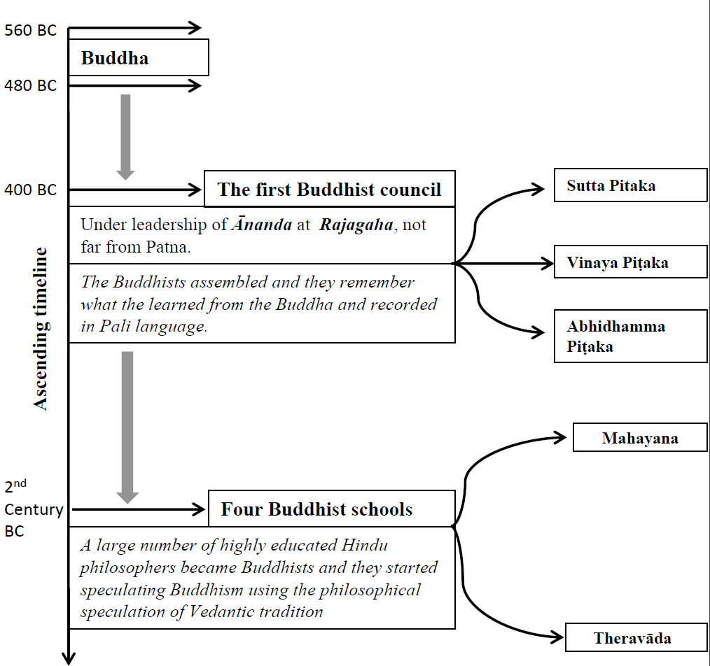
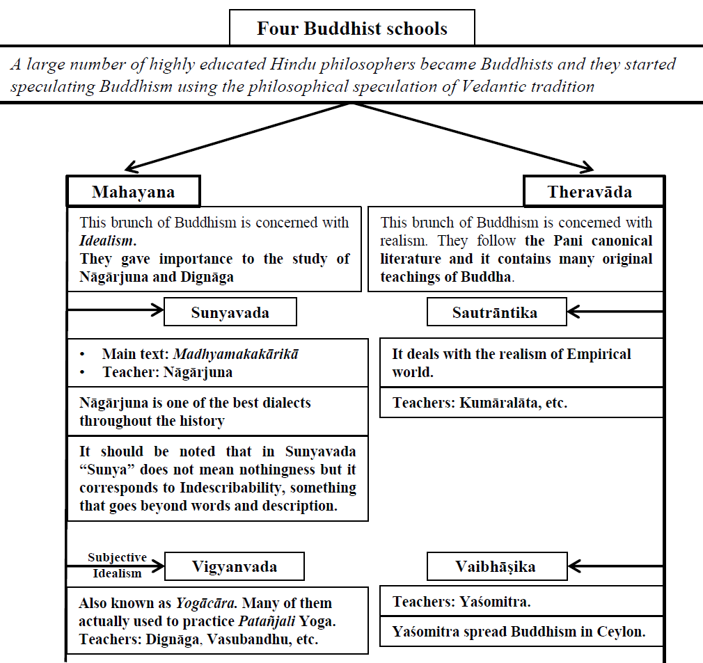

In the following I am presenting my understanding based elaboration and illustration of The Foundational text in Indian Philosophy. All the images are unique and proper references are mentioned in the text. <b>My special thanks to Aritra Sarkar, Tamal Acharya and Chandika Pegu for going though the article and valuable comments</b>.

###  **Why it is important to study?** 

In Indian tradition there is word called “Parampara” that literally means a continuous flow, just like a river. So if you get into the river you temporarily become the part of the flow. 

Indian spiritual and philosophical traditions are just like a continuous a continuous flow. Hence it represents a succession of the teacher and the student where the student becomes an integral part of the teacher’s lineage.

###  **A Piece of Dry Leaf Floating in the Air** 

While discussing philosophy an ideal teacher should give justice to the subject the teacher is dealing with, which means whenever a statement is made in the process of learning the teacher must give scriptural/textural link from where it is coming.

This is quite important in the modern era of Internet. The main reason behind this is if someone teaches a system of philosophy or spirituality without giving any connections with the teachers or ancient masters then it could be anything from a crazy non-authentic idea to a wild spiritual fantasy of his/her mind that can spread around the world to bind a group of people into a belief or understanding that does not have a scriptural testimony. 
As an example, Mindfulness, whose essence is being in a state of absolute and complete awareness and detachment is a very important and popular in modern times, which is based on a Buddhist canonical literature called <b> Mahā Satipaṭṭhāna Sutta (in Pali)</b> which translates into <b>“the establishing (upaṭṭhāna) of mindfulness (sati)” or Mahā Smṛtyupasthāna (in Sanskrit)</b>. There are two verses <b>Mahā Satipaṭṭhāna Sutta</b> represents the bigger full version of the verse whereas <b>Satipaṭṭhāna Sutta</b> is the smaller one. 

Now suppose while teaching this you forget Buddha or you refuse to accept any connection with the real great Buddha then the whole topic of <b>“Mindfulness”</b> will be like <b>“A Piece of Dry Leaf Floating in the Air”</b> one day it could be forgotten. 

And if you always refer the topic of Mindfulness with the background of a great spiritual teacher, the World once produced, who himself was an embodiment of Mindfulness then the question of getting deviated from the main essence of the practice never arises due to its unshakable root.

###  **Twelve Distinct Philosophical Systems** 

Any book on Indian Philosophy refers to twelve distinct systems of philosophy in Indian tradition. In fact there are more systems but the mentioned twelve are one of the most important ones. Behind every idea, every system of philosophy there is a great sage, a great meditative mind. They not only had a highly philosophical and spiritual mind but they used to live in a world of higher philosophy. Let us jump into Indian philosophical systems which are <b>fundamentally split into two kinds of outlooks based on the fundamental source of spiritual revelation“Āstika-darśana” and “Nastika-darśana”</b>. See the Figure below.

<b>“Āstika”</b> and <b>“Nastika”</b> was first introduced in <b>Aṣṭādhyāyī</b>, dated to around 500 BCE, is a Grammar that describes an Indo-Aryan form of Sanskrit. It is Authored by a Sanskrit Philologist and scholar <b>Pāṇini</b>. In the <b>Aṣṭādhyāyī on 4th Chapter of verse 4.4.60 Pāṇini mentions</b>:

 <b>“Astināstidiṣṭaṁ matiḥ”</b> 

<b>One of the fundamental differences in Āstika-darśana” and “Nastika-darśana” is that:</b> 

Nastika does not believe in continued existence of life after death but to live a good life in this world. Whereas Āstika does not only believe in continued existence but they imply that the human life is not for enjoyment but meant for a higher purpose and in Vedanta this higher purpose is to realize your own spiritual identity.
 

There are a total of 7 schools of Vedanta with their own interpretation on spiritual reality based on their own interpretation of Brahma Sūtras. We will elaborate on them pretty soon

 <b>Both the “Āstika” and “Nastika” are divided into six schools of Philosophy.</b> As shown in the following illustration:

###  **The Origin of the Four Schools of Buddhism** 

<!-- ### <b>"Now I Am Become Death, the Destroyer of Worlds":</b> -->

Before talking elaborately about the four schools of Buddhism that emerged in India long after Buddha’s passing, we must understand that The Buddha was not concerned about the metaphysics or philosophy, his system of teaching was purely based on a desire. A desire to see people living a good life in this world. His teachings were not concerned on life after death.

<!-- ### <b>"Now I Am Become Death, the Destroyer of Worlds":</b> -->

We can divide Buddhism into two stages as (1) Early (2) Later developements in Buddhism. Which is illustrated in following:

<!-- ### <b>"Now I Am Become Death, the Destroyer of Worlds":</b> -->

<!-- ### <b>"Now I Am Become Death, the Destroyer of Worlds":</b> -->

 Among the Four Buddhist Schools <b>Sautrāntika and Vaibhāṣika are part of Theravāda</b> whereas <b>Sunyavada and Vigyanvada (or Yogachara ) are part of Mahayana</b> as depicted in the following:

<!-- ### <b>"Now I Am Become Death, the Destroyer of Worlds":</b> -->

<!-- ### <b>"Now I Am Become Death, the Destroyer of Worlds":</b> -->

The four schools are classified according to epistemology i.e. the theory of knowledge. The knowledge related to a question:

<!-- ### <b>"Now I Am Become Death, the Destroyer of Worlds":</b> -->

 <b>“What is the universe you are seeing?”</b> 

<!-- ### <b>"Now I Am Become Death, the Destroyer of Worlds":</b> -->

 <b>Sautrāntika:</b> According to this school, we are directly perceiving the universe. There are things in the universe and we are perceiving it with our senses. So there are the "experiencer" and what we are experiencing is outside the "experiencer". 

<!-- ### <b>"Now I Am Become Death, the Destroyer of Worlds":</b> -->

 <b>Vaibhāṣika:</b> According to this school, what you are seeing now, is a representation of what existis outside, in your mind. So there is "something" outside, the information about the "something" is collected by your saenses, and then the information is recreated in your mind hence what you are preceiving is a recreation of the reality. This is what modern 21st science would agree upon and termed as Representative reality, which was established in India 20 century ago in a more sophisticated manner.   

<!-- ### <b>"Now I Am Become Death, the Destroyer of Worlds":</b> -->

 <b>Vigyanvada:</b> According to this school, they consideer the reality is only mind. The main question they explore is "How do you know there is something exists to preceive at all?" If there is something outside then yopu have noi access to it so in mind the world is formed. In simple words there is no outside world only your mind. Through this practice you cut off the external world, that is why it is also called Yogācāra.

 <b>Sunyavada:</b> According to this school, there is no mind, no external world but only Sunyata. <b>It should be noted that "Sunyata" should not be taken as nothingness.</b> The studies of this school is completely based on the <b> Mūlamadhyamakakārikā by Nāgārjuna</b>. He was concerned about a question:

 <b>" Is reality something that exists?”</b> 

 One can formulate four possible responses which is called <b>"Catuṣkoṭi"</b>. And they are as follows: 

(1) <b>Positive:</b> It exists.
 

(2) <b>Negative:</b> It does not exists.

(3) <b>Conjunction:</b> It exists and it does not exists.
 

(4) <b>Denial of Conjunction:</b> It neither exists and it nor does not exists.

 <b>In simple words Nāgārjuna in Mūlamadhyamakakārikā denies the "Catuṣkoṭi" and that the reality is beyond the four alternatives. Which can not be expressed or preceived. In the response to the critiques who consider "Buddhists as Nihilists" Nāgārjuna in a separate verse of Mūlamadhyamakakārikā says "Thos who charge us of being Nihilists they do us an injustice".</b> 

<b>(Stay tuned...)</b>

 <u><b>REFERENCES</b></u> 

 
[1] <a href="https://www.youtube.com/watch?v=mnQ0G00w3iQ&list=PLDqahtm2vA73W7DqEsvSs56eYXJ3jJlHc"><b>The Foundational Texts of Indian Philosophy (Overview) by Swami Tattwamayananda</b></a>

 
[2] <a href="https://www.youtube.com/watch?v=B_7nfOMCsj0&list=PL2imXor63HtRJbtP4mMt-Q2ke8XOkL7pX&index=44"><b>Mandukya Upanishad (Chapter 3 Karika 29-30) by Swami Sarvapriyananda</b></a>

 
[3] <a href="http://www.hathajoga.com.pl/joga/czytelnia/parampara"><b>Definition of Parampara</b></a>

 
[4] <a href="https://www.dhammatalks.org/suttas/DN/DN22.html"><b>Mindfulness</b></a>

### <b>"Now I Am Become Death, the Destroyer of Worlds":</b>

The title of this section was <b>quoted by the great physicist J. Robert Oppenheimer</b> when he was expreincing the detonation of the first atomic weapon in the year 1945. Some of us might be able to recreate the scenario using our imaginations, where a growing mountain sized mushroom cloud of fire suddenly appears in front of your eyes followed by a burst of wind as an aftermath of the explosion. It is probably like seeing a thousands sun sets together in front of you and you as an observer just stare in astonishment. But here we will not explore the psycological aspect of Oppenheimer but we stress on understanding the source of this beautifully horryfing quote and its original meaning.

There are a total of 18 chapters and a whopping 200,000 verses in the epic <a href="https://en.wikipedia.org/wiki/Mahabharata"><b>The Mahabharata</b></a>. <a href="https://en.wikipedia.org/wiki/Bhagavad_Gita"><b>Bhagavad Gita</b></a> is a Hindu sculpture that contains 700 verses from The Mahabharata. The Bhagvad Gita captures the conversation between the <a href="https://en.wikipedia.org/wiki/Krishna"><b>Lord Krishna</b></a> and Pandavas prince <a href="https://en.wikipedia.org/wiki/Arjuna"><b>Arjuna</b></a> in the battle field of <a href="https://en.wikipedia.org/wiki/Kurukshetra"><b>Kurukshetra</b></a>, facing an opposing army that contains his close relatives. Faving them Arjuna is completely torn. In the midst of this Lord Krishna teaches him about a higher philosophy that will enable him to carry out his duties as a warrior irrespective of his personal concerns.