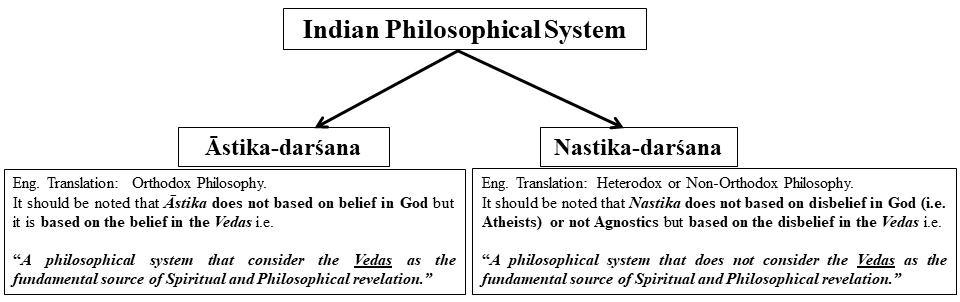
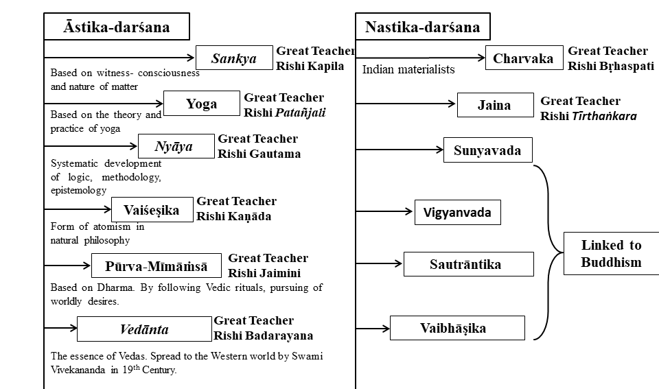

In the following I present my understanding based elaboration and illustration of The Foundational text in Indian Philosophy. All the images are unique and proper references are mentioned in the text.

###  **Why it is important to study?** 

In Indian tradition there is word called “Parampara” that literally means a continuous flow, just like a river. So if you get into the river you temporarily become the part of the flow. 

Indian spiritual and philosophical traditions are just like a continuous a continuous flow. Hence it represents a succession of the teacher and the student where the student becomes an integral part of the teacher’s lineage [2].

###  **A Piece of Dry Leaf Floating in the Air** 

While discussing philosophy an ideal teacher should give justice to the subject the teacher is dealing with, which means whenever a statement is made in the process of learning the teacher must give scriptural/textural link from where it is coming.

This is quite important in the modern era of Internet. The main reason behind this is if someone teaches a system of philosophy or spirituality without giving any connections with the teachers or ancient masters then it could be anything from a crazy non-authentic idea to a wild spiritual fantasy of his/her mind that can spread around the world to bind a group of people into a belief or understanding that does not have a scriptural testimony. 
As an example, Mindfulness, whose essence is being in a state of absolute and complete awareness and detachment is a very important and popular in modern times, which is based on a Buddhist canonical literature called <b> Mahā Satipaṭṭhāna Sutta (in Pali)</b> which translates into <b>“the establishing (upaṭṭhāna) of mindfulness (sati)” [3] or Mahā Smṛtyupasthāna (in Sanskrit)</b>. There are two verses <b>Mahā Satipaṭṭhāna Sutta</b> represents the bigger full version of the verse whereas <b>Satipaṭṭhāna Sutta</b> is the smaller one. 

Now suppose while teaching this you forget Buddha or you refuse to accept any connection with the real great Buddha then the whole topic of <b>“Mindfulness”</b> will be like <b>“A Piece of Dry Leaf Floating in the Air”</b> one day it could be for forgotten. 

And if you always refer the topic of Mindfulness with the background of a great spiritual teacher, the World once produced, who himself was an embodiment of Mindfulness then the question of getting deviated from the main essence of the practice never arises due to its unshakable root.

###  **Twelve Distinct Philosophical Systems** 

Any book on Indian Philosophy refers to twelve distinct systems of philosophy in Indian tradition. In fact there are more systems but the mentioned twelve are one of the most important ones. Behind every idea, every system of philosophy there is a great sage, a great meditative mind. They not only had a highly philosophical and spiritual mind but they used to live in a world of higher philosophy. Let us jump into Indian philosophical systems which are <b>fundamentally split into two kinds of outlooks based on the fundamental source of spiritual revelation“Āstika-darśana” and “Nastika-darśana”</b>. See the Figure below.

<b>“Āstika”</b> and <b>“Nastika”</b> was first introduced in <b>Aṣṭādhyāyī</b>, dated to around 500 BCE, is a Grammar that describes an Indo-Aryan form of Sanskrit. It is Authored by a Sanskrit Philologist and scholar <b>Pāṇini</b>. In the <b>Aṣṭādhyāyī on 4th Chapter of verse 4.4.60 Pāṇini mentions</b>:

 <b>“Astināstidiṣṭaṁ matiḥ”</b> 

<b>One of the fundamental differences in Āstika-darśana” and “Nastika-darśana” is that:</b> 

Nastika does not believe in continued existence of life after death but to live a good life in this world. Whereas Āstika does not only believe in continued existence but they imply that the human life is not for enjoyment but meant for a higher purpose and in Vedanta this higher purpose is to realize your own spiritual identity.
 

There are a total of 7 schools of Vedanta with their own interpretation on spiritual reality based on their own interpretation of Brahma Sūtras. We will elaborate on them pretty soon

 <b>Both the “Āstika” and “Nastika” are divided into six schools of Philosophy.</b> As shown in the following illustration:

